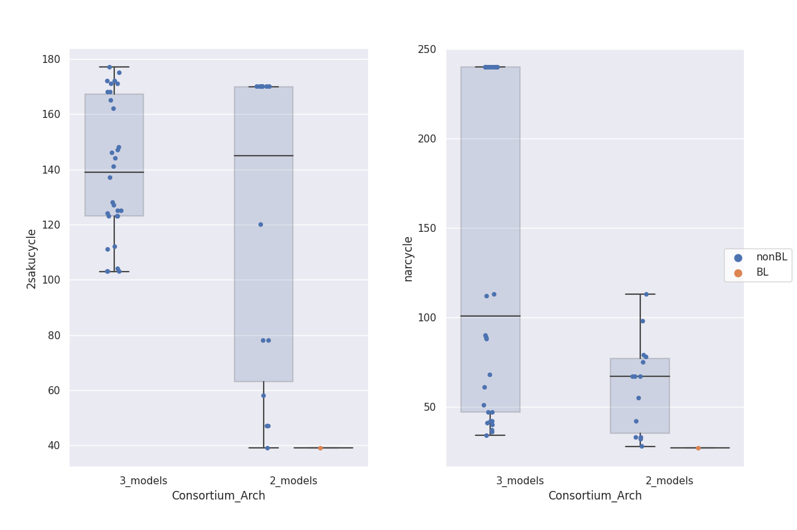

```{r, include = FALSE}
colorize <- function(x, color) {
  if (knitr::is_latex_output()) {
    sprintf("\\textcolor{%s}{%s}", color, x)
  } else if (knitr::is_html_output()) {
    sprintf("<span style='color: %s;'>%s</span>", color, 
      x)
  } else x
}

# USE: Using now color `r colorize("red", "red")`.
```

\newpage
# 1. First Testing Example: Production of 2S-sakuranetine {#FirstExample}

## 1.1. Consortia Description {#FirstExample_ConsortiaDescription}

The consortia here evaluated were designed for **naringenin production and further metilation**: the final product was meant to be 2S-sakuranetine. There were two different alternatives for the pathway to be distributed among the available strains.

* **A 2-model consortium** where:

  a. *E.coli iEC1364W* (base strain) was responsible for fructose and p-coumarate (pCA) production, and naringenin metilation.
  b. *P.putida iJN1463* was responsible for malon and naringenin production, and cobalamin production. \newline
  
* **A 3-model consortium** where:

  a. *E.coli iEC1364W* (base strain) was responsible for fructose and p-coumarate (pCA) production.
	b. *E.coli iEC1364W* (metilator strain, non-fructose producer) was responsible for naringenin metilation.
	c. *P.putida iJN1463* was responsible for malon and naringenin production, and cobalamin production. \newline


## 1.2. FLYCOP configuration for the execution {#FirstExample_FLYCOPconfiguration}

The current analysis was performed to maximize 2S-sakuranetine production, by evaluating different ranges of values for a series of metabolic parameters: uptake and FVA (Flux Variability Analysis) rates, and initial biomass values. The M9 medium was used as layout, as provided in the [`r colorize("GitHub profile", "blue")`](https://github.com/ivanmm25/FLYCOP_tools). The original parameters used in the SMAC optimization were (`params.pcs` file):

- p01_sucr1 ordinal {-18,-16,-14,-12,-10,-8,-6,-4,-2} [-2]
- p02_frc2 ordinal {-18,-16,-14,-12,-10,-8,-6,-4,-2} [-14]
- p03_nh4Ec ordinal {-18,-16,-14,-12,-10,-8,-6,-4,-2} [-10]
- p04_nh4KT ordinal {-18,-16,-14,-12,-10,-8,-6,-4,-2} [-10]
- p05_FVApCA ordinal {0.75,0.8,0.85,0.9,0.95} [0.95]
- p06_FVAfru ordinal {0.75,0.8,0.85,0.9,0.95} [0.95]
- p07_FVAMetNar ordinal {0.75,0.8,0.85,0.9,0.95} [0.95]
- p08_FVANar ordinal {0.75,0.8,0.85,0.9,0.95} [0.95]
- p09_nmodels categorical {2_models, 3_models} [3_models]
- p10_biomass_Ecb ordinal {0.01,0.02,0.04,0.06,0.08,0.1} [0.04]
- p11_biomass_KT ordinal {0.01,0.02,0.04,0.06,0.08} [0.04] 
- p12_biomass_Ecmet ordinal {0.01,0.02,0.04,0.06,0.08,0.1} [0.04]\newline

Moreover, other **layout parameters** to note were:

- **Grid Size (inoculation point)**: 1, 1 (0, 0).
- **Number of cycles**: 240.
- **`maxSpaceBiomass` parameter**: 10.0 gL^-1^.

The **fitness function** was represented as **2S-sakuranetine yield** (mM/gL^-1^): total production (mM), divided by global final biomass (gL^-1^). Note that all configurations have been run with a **SD (standard deviation) cutoff value of (0.1)·(`avgfitness`)**. \newline

It is worth noticing that the **main concerns of this analysis** were the following ones.

- Determining which of both consortium architectures was better suited for 2S-sakuranetine production: 2 or 3 strains in the community.

- Finding a range of optimal nutrient uptake rates and initial biomasses for the consortium to be optimized, in order to allow for 2S-sakuranetine production under M9 medium conditions (for one or both consortium architectures).

- Obtain a reasonable combination of FVA rates to optimize the production of 2S-sakuranetine. \newline


## 1.3. Base Context of FLYCOP execution {#FirstExample_BaseContext}

At first, the *EcPp3_scenario0_FLYCOPdataAnalysis/PreliminaryAnalysis* folder was evaluated. In this folder, the files of interest are the next ones.

* **'ConfigurationsSummary_n_models.txt'**. For the case of 2-model architecture, there were 70 total (acceptable) configurations, of which 15 of them had an acceptable SD (< 10% of average fitness): 1 of them experienced biomass loss, while the other 14 did not experience this effect. There was a notable amount of cases (55) with an excessive SD. For the case of 3-model architecture, there were 30 total (acceptable) configurations, of which all of them had an acceptable SD and they did not experience biomass loss.

* **'ErrorSummary_n_models.txt'**. In no consortium architecture were found errors of any type (neither *ZeroDivisionError* nor non-optimal COBRA solutions). This conclusion can be also found in the *FLYCOP_XXX_Z_log.txt* file. \newline

\newpage


## 1.4. General Analysis: distribution of configurations {#FirstExample_GeneralAnalysis}

In this first section, a general analysis was performed where **the distribution of configurations in the complete FLYCOP run has been assessed**, according to: i) consortium architecture (2-model vs. 3-model); ii) acceptable vs. sub-optimal configurations in COBRA terms; iii) effects of biomass loss.

The barplot in Figure 1 summarizes the information given by both *'ConfigurationsSummary_n_models.txt'* files. There were 30 configurations for the architecture of 3 models, all of them acceptable and without biomass loss effect. At the same time, there were 15 acceptable configurations for the architecture of 2 models, with (1) or without (14) biomass loss. Recall that the 55 configurations with an extensive SD in the 2-model architecture were discarded for the rest of the analysis. \newline

{width=50%}


### 1.4.1 General Analysis: exchange rates {#FirstExample_GeneralAnalysis_exchangeRates}

Before starting the analysis, an important disclaimer should be stated: **uptake rates take negative values by convention**. However, a more-negative uptake rate (i.e. lower value) means a higher uptake, since the true meaning relies on the absolute value.

The different consortium architectures were compared in terms of exchange rates (sucrose, fructose and nitrogen uptake rates) by means of several barplots (Figure 2). Note that all configurations displayed (15) were acceptable configurations: the 14 cases with no biomass loss were analyzed. \newline

{width=100%}

* **Sucrose** was the main substrate for the *E.coli iEC1364W* strains: the base strain in the 2-model consortium and both (base and metilator) strains. However, the metilator strain could also consume fructose. For the 2-model cases, uptake rates were variable and the most common value was intermediate (-10 mmol/ g DW h). In turn, 3-model cases displayed two peaks of values, around -16, -14 (mmol/ g DW h) (higher sucrose uptake) and -2 (mmol/ g DW h) (lower uptake). See far-left plot.

* **Fructose** was the main substrate for the *P.putida iJN1463* strain. However, the *E.coli iEC1364W* metilator strain could also consume fructose. While 2-model uptake rates were variable, with -14 and -2 (mmol/ g DW h) being the most common values; 3-model rates showed a peak for intermediate values (-10, -6 mmol/ g DW h). See middle-left plot.  

* The **middle-left plot** showed the distribution of nitrogen uptake rates for all *E.coli iEC1364W* strains in both consortia. For the 2-model consortium, $NH_4$ uptake rates were more frequent for more-negative values (-18, -14 mmol/ g DW h) or for a less-negative one instead (-4 mmol/ g DW h). However, the 3-model consortium tended to intermediate-to-high (less-negative) rates (-8, -6, -4 mmol/ g DW h).

* The **far-right plot** showed the distribution of nitrogen uptake rates for the *P.putida iJN1463* strain in both consortia. For the 2-model consortium, $NH_4$ uptake rates were more frequent for less-negative values (-10 mmol/ g DW h or above). A similar peak of configurations was also found for the 3-model case (-10, -8, -6 mmol/ g DW h). \newline

The only case with biomass loss (barplot not shown) was a 2-model configuration with -16, -18, -4 and -2 (mmol/ g DW h) as sucrose, fructose, (*E.coli iEC1364W*) nitrogen and (*P.putida iJN1463*) nitrogen uptake rates. \newline


**Exchange rates could be also compared in term of fitness** for both consortium architectures (Figure 3). For the 3-model consortium, there were no substantial fitness differences for any particular value of exchange rate. In turn, this was not the case for the 2-model scenario: higher fitness values were obtained for certain values of each of the exchange rates considered. 

Despite the last fact, a further analysis was not performed given the **limited sample size of the 2-model group of configurations**: one or two exceptional cases might not be enough support for such fitness differences. However, Figure 3 proved the potential use of these scatterplot representations for exchange rates.

{width=100%}


### 1.4.2. General Analysis: FVA rates {#FirstExample_GeneralAnalysis_FVARates}

On the other hand, the analysis of the **FVA rates for intermediate and final products** was considered: p-coumarate by *E.coli iEC1364W* (base strain in both consortia), fructose by *E.coli iEC1364W* (base strain in both consortia), naringenin by *P.putida iJN1463* and 2S-sakuranetine by *E.coli iEC1364W* (base or metilator strain) (Figure 4). Note that the higher the FVA rate (%) for a given compound, the lower the metabolic flux deviated towards its production. \newline

{width=90%}

* The far-left plot showed the values of **p-Coumarate FVA**. For the 2-model consortium, the number of configurations tended to be higher for very high (0.95) FVA rates (i.e. low flux deviated towards p-Coumarate production). For the 3-model consortium, the number of configurations was more uniformly distributed along the FVA rate interval.

* The medium-left plot showed the values of **fructose FVA**. For the 2-model consortium, common values were 0.75 or 0.85 (intermediate-to-low), and there were no cases of 0.95. In turn, the most frequent rate for the 3-model consortium was 0.95 and secondly, lower values of 0.75 and 0.80.

* The medium-right plot showed the values of **2S-sakuranetine FVA**. For the 2-model consortium, the most common and only values were 0.75, 0.85 and 0.95. However, for the 3-model consortium, lower values were far more common (0.8).

* The far-right plot showed the values of **naringenin FVA**. For the 2-model consortium, FVA rates of 0.8, 0.85 tended to be more frequent. On the other hand, higher values were predominant (0.90, 0.95) in the 3-model consortium. \newline

The only case with biomass loss (barplot not shown) was a 2-model configuration with 0.8, 0.75, 0.85 and 0.95 as FVA rates for p-Coumarate, fructose, 2S-sakuranetine and naringenin. \newline


**FVA rates could be also compared in term of fitness** for both consortium architectures (Figure 5). For the 3-model consortium, there were no substantial fitness differences for any particular value of FVA rate. In turn, this was not the case for the 2-model scenario: higher fitness values were obtained for certain values of each of the FVA rates considered. 

Despite the last fact, a further analysis was not performed given the **limited sample size of the 2-model group of configurations**: two or three exceptional cases might not be enough support for such fitness differences. However, Figure 5 proved the utility of these scatterplot representations also for FVA rates.

{width=100%}


## 1.5. Pairwise Variable Analysis {#FirstExample_PairwiseVariableAnalysis}

In this second section, the different consortium architectures were evaluated in terms of pairwise interactions[^pairwise_interactions_disclaimer] between variables of interest. Recall that all configurations were acceptable, with a bunch of discarded 2-model cases because of an excessive standard deviation. In turn, there was just 1 configuration with biomass loss for the 2-model consortium.

[^pairwise_interactions_disclaimer]: Recall that uptake rates take negative values by convention. Thus pairwise interactions (in heatmaps and pairgrid plots) between uptake rates and the rest of variables are inverted: i.e. a negative correlation between nitrogen uptake and final biomass would mean that, the higher the nitrogen uptake, the higher the final biomass. This eventuality does not hold true for pairwise interactions between uptake rates themselves, since both in every pair would be negative.


### 1.5.1. Fitness evaluation with respect to SD {#FirstExample_PairwiseVariableAnalysis_fitnessScatter}

The next figure (Figure 6) displays the variation of fitness SD with the fitness variable by means of a scatterplot. Acceptable configurations with and without biomass loss were considered.

{width=40%}

On the one hand, the **3-model consortium** (non-biomass loss cases) achieved lower values of fitness (around less than 1 to 2.5 mM / gL^-1^), which might have led to lower values of standard deviation (under 0.1 mM / gL^-1^). There were no cases of biomass loss for this consortium architecture. On the other hand, the **2-model consortium** (non-biomass loss cases) achieved higher values of fitness (between 6 and 13 mM / gL^-1^) with a more widespread SD (between 0.05 and 0.6 mM / gL^-1^). A higher fitness was in hand with a higher SD. The configuration with biomass loss showed a fitness around 7.0 $\pm$ 0.55 mM / gL^-1^.


### 1.5.2. Pairgrid plotting {#FirstExample_PairwiseVariableAnalysis_pairgrid}

Figure 7 shows a pairgrid integrating uptake rates, global biomass register and 2S-sakuranetine production. This figure is composed of three sections.

{width=80%}

* The **lower corner** displayed a **scatterplot-regression plot**. This type of plot made evident the positive correlation between global final biomass and initial biomass for the 2-model group, being this relationship notably more moderated in the 3-model case. At the same time, there was also a similar correlation between final production of 2S-sakuranetine and both global initial and final biomass for the 2-model consortium, being very slight or non-existent for the 3-model case.

  Likewise, a moderate, positive correlation for sucrose uptake with nitrogen uptake by *E.coli iEC1364W* and *P.putida iJN1463* was found for the 2-model consortium. Moreover, sucrose and nitrogen uptake rates (for both strains) were also positively correlated with final biomass and 2S-sakuranetine production for the same architecture: in other words, a higher uptake of nitrogen and sucrose would result on a lower fitness and consortium production. This same effect was not detected in the 3-model case.

* The **pairgrid diagonal** displayed a **barplot** with a histogram line where the degree of similarity between consortium architectures was measured for each variable. The greatest differences were found for the final biomass and 2S-sakuranetine production (lower degree of overlapping).

* The **upper corner** displayed a **kdeplot** (Kernel Density Estimation plot) where both the correlation between two variables and the degree of overlapping between consortium architectures were evaluated. No substantial differences could be appreciated between the 3-model and 2-model groups in terms of uptake rate interaction. However, there was a medium-to-low degree of overlapping between consortium architectures for any variable *vs*. final biomass or 2S-sakuranetine production. The only exception, with no-overlapping at all, was the kdeplot with final biomass *vs*. 2S-sakuranetine production. \newline


### 1.5.3. Heatmap representation {#FirstExample_PairwiseVariableAnalysis_heatmap}

Figure 8 shows the heatmap for the 3-model consortium case. Acceptable configurations without biomass loss were considered for its construction.

{width=100%}

* Sucrose uptake was negatively correlated with nitrogen uptake by *P.putida iJN1463* (-0.39), and positively correlated with nitrogen uptake by *E.coli iEC1364W* (0.2). At the same time, there were several positive correlations for sucrose uptake with initial (0.33) and final (0.28) biomass, and with 2S-sakuranetine production (0.42), i.e. a higher sucrose uptake led to lower biomass growth and final production.

* Fructose uptake was negatively correlated with nitrogen (*E.coli iEC1364W*) uptake (-0.32) and, to a lower extent, with final biomass (-0.13). Therefore, a higher fructose uptake would benefit biomass evolution in the consortium.

* Nitrogen (*E.coli iEC1364W*) uptake, while being negatively correlated with (*P.putida iJN1463*) nitrogen uptake (-0.17); was positively correlated with initial (0.23) and final (0.18) biomass, and with 2S-sakuranetine production (0.2). Again, a wider development of *E.coli iEC1364W* models might imply lower consortium production.

* Nitrogen (*P.putida iJN1463*) uptake was negatively correlated with initial (-0.18) and final (-0.25) biomass: a higher nitrogen uptake led to a wider biomass growth.

* Finally, there was a positive correlation between initial and final biomass (0.5); and between initial biomass and 2S-sakuranetine production (0.63). However, the correlation between final biomass and 2S-sakuranetine production was nearly non-existent (-0.044), thus indicating that they did not directly compete but did not either benefit from each other. \newline


In turn, Figure 9 shows the heatmap for the 2-model consortium case. Acceptable configurations without biomass loss were considered for its construction.

{width=100%}


* Positive correlations were found for sucrose with nitrogen (*E.coli iEC1364W*) (0.47) and nitrogen (*P.putida iJN1463*) uptake (0.28) rates. In turn, there were several moderate, positive correlations for sucrose uptake with initial (0.23) and final (0.19) biomass, and with 2S-sakuranetine production (0.12). Again, a reasonable interpretation would be that too high sucrose uptake might partially hinder biomass and 2S-sakuranetine production.

* Notably, fructose uptake was negatively correlated with nitrogen (*P.putida iJN1463*) uptake (-0.48) and, to a lower extent, with initial (-0.15) and final biomass (-0.18), and with 2S-sakuranetine production (-0.3). Thus in this 2-model scenario, higher fructose uptake would favour biomass development and, in spetial, 2S-sakuranetine production.

* Nitrogen (*E.coli iEC1364W*) uptake showed positive correlations with initial biomass (0.43) and 2S-sakuranetine production (0.39), and a moderate correlation with final biomass (0.28). In turn, nitrogen (*P.putida iJN1463*) uptake showed a moderate, positive correlation with 2S-sakuranetine production (0.2). In this regard, nitrogen uptake would be inversely correlated with 2S-sakuranetine production.

* Correlations for initial biomass with final biomass (0.66) and with 2S-sakuranetine production (0.74) were highly positive. In a similar way, a pronounced correlation was found for final biomass and 2S-sakuranetine production (0.86). \newline


## 1.6. Biomass & Production Analysis {#FirstExample_BiomassProductionAnalysis}

In this third section, the different consortium architectures were evaluated in terms of a) individual biomass states at the beginning and end of every simulation; b) final production of naringenin and 2S-sakuranetine; and c) consumption of substrates. Recall that all configurations were acceptable, with 30 and 15 cases for the 3-model and 2-model consortia, respectively. Given that there was just 1 case of biomass loss within the 2-model group, it has not been considered in the further analysis. \newline

### 1.6.1. Biomass Analysis {#FirstExample_BiomassProductionAnalysis_biomassAnalysis}

On the one hand, global biomass was analyzed at the beginning and end of every simulation (Figure 10).

{width=100%}

* The **global initial biomass** was higher on average for the 3-model consortium (0.14 gL^-1^) than for the 2-model case (~0.08 gL^-1^). In the first case, the biomass interval ranged from 0.05 to near 0.30 (gL^-1^), while ranging from near 0 to 0.16 (gL^-1^) in the second one.

* The **global final biomass** was much higher for the 3-model than for the 2-model consortium. In the first case, the biomass interval ranged from 1.50 to 2.25 (gL^-1^), with an average value around 1.80 gL^-1^. In the second case, the biomass interval was contained from 0.25 to around 1.75 (gL^-1^), with an average value of 0.50 gL^-1^. \newline


On the other hand, an individual analysis of biomass per strain for each of the consortium architectures was also developed (Figure 11).

* For the **3-model consortium**, initial values were similar for all three strains. In turn, average final values were around 0.2, 0.3 and 0.4 gL^-1^ for *E.coli iEC1364W* (base strain), *P.putida iJN1463* and *E.coli iEC1364W* (decorator strain, iEC1364Wmet) models, respectively. Likewise, final biomass ranges were also similar for all three strains (0.0 to 1.6 gL^-1^).

* For the **2-model consortium**, initial values were similar for both strains. In turn, average final values were around 0.2, 0.3 gL^-1^ for *E.coli iEC1364W* (base strain, iEC1364Wumet) and *P.putida iJN1463*, respectively; with similar biomass ranges from 0.10 to 0.90 gL^-1^.

{width=80%}


### 1.6.2. Production Analysis {#FirstExample_BiomassProductionAnalysis_productionAnalysis}

Firstly, Figure 10 displayed the final concentration for several metabolites (substrates, products) with distinction by consortium architecture.

{width=80%}

* **Final production values of 2S-sakuranetine** were more widespread for the 2-model architecture, with an upper limit near 20.0 mM. However, average production was around 3.0-3.5 mM for both consortium architectures.

* **Naringenin production ranges** were widespread for both consortium architectures, but notably more in the 2-model case (with an upper limit near 50.0 mM). However, average values were slightly different: around 2.0 mM (3-model cases) and 9.0 mM (2-model cases).

* **Nitrogen ($NH_4$)** was always fully exhausted for the 3-model case configurations, while displaying a quite dispersed range of values (from complete exhaustion to near 15.0 mM) for the 2-model configurations. The average value for this last architecture was around 12.0 mM.

* **Phosphate ($P_i$)** was usually consumed to a low extent for the 3-model case, though there were a few cases where $P_i$ was produced. A similar effect was found for the 2-model case, but with a slightly higher amount of configurations (in proportion) where $P_i$ was produced. It is worth noticing that the y-axis scale in the plot does not allow to determine in detail final phosphate values.

* **Final sucrose concentration** was around 65 to 85 mM for most of the configurations of the 3-model architecture. For the 2-model case, a wider final sucrose range was found (from 20 to 90 mM). Average values were around 75, 85 mM for the 3-model and 2-model cases, respectively.

* **Average $O_2$ consumption** was higher for the 3-model configurations (940 mM as final concentration) than for 2-model cases (above 980 mM). However, 2-model configurations were distributed along a wider interval, from 880 to near 1000 mM.


Secondly, it was worth considering **the cycle when the main substrates were finally exhausted**, if appropriate (Figure 13). In general, neither sucrose, nor oxygen or $P_i$ were consumed in any of the configurations for any of the consortium architectures. However, **$NH_4$** was always exhausted during the simulation for the 3-model case between cycles 90 and 200 (on average, around cycle 140). In turn, nitrogen was fully consumed in 5 out of 15 configurations for the 2-model consortium.

{width=100%}

Figure 13 might not be fully useful, given that four out of five plots are just a line of points in the same y-value for both consortium architectures. Thus there was an alternative instead: using an statistical descriptive document where the average endcycle of nutrient exhaustion (among other statistical variables) was indicated.

For the **3-model configurations**:

  * Sucrose cycle of final exhaustion: 240.0 $\pm$ 0.0
  * $O_2$ cycle of final exhaustion: 240.0 $\pm$ 0.0
  * $P_i$ cycle of final exhaustion: 240.0 $\pm$ 0.0
  * $NH_4$ cycle of final exhaustion: 140.1 $\pm$ 31.1
  * General endcycle: 240.0 $\pm$ 0.0 \newline
  
For the **2-model configurations**:

  * Sucrose cycle of final exhaustion: 240.0 $\pm$ 0.0
  * $O_2$ cycle of final exhaustion: 240.0 $\pm$ 0.0
  * $P_i$ cycle of final exhaustion: 240.0 $\pm$ 0.0
  * $NH_4$ cycle of final exhaustion: 228.8 $\pm$ 21.9
  * General endcycle: 240.0 $\pm$ 0.0 \newline
  
Therefore, **nitrogen was exhausted in all 3-model architecture cases** (the maximum value for nitrogen exhaustion cycle was 195.0) and in 7 of the 15 2-model configurations (the minimum value for nitrogen exhaustion cycle was 166.0). The rest of substrates were never fully consumed in any of the consortium architectures. \newline


In turn, **the cycle were naringenin and 2S-sakuranetine production started or was stabilized** has been registered. Production stabilization was considered to happen when the concentration of a given metabolite was above 1.0 mM (Figure 14).

{width=80%}

* On average, **2S-sakuranetine production** started around cycle 140-145 for both consortium architectures. In general, the stabilization of 2S-sakuranetine production happened between cycles 40 and 170 for the 2-model configurations, and between cycles 100 and 180 for the 3-model cases.

* On the other hand, **naringenin production** started before for the 2-model configurations (around cycle 60-70) than for the 3-model cases (around cycle 100), on average. However, in this case the production range was narrower for the 2-model configurations (between cycles 20 to 120) than for the 3-model cases (between cycles 25 to 240), probably indicating than naringenin production has been more stable in the 2-model scenario. \newline


A similar statistical analysis was performed for the last two variables, as a more compact summary for production stabilization.

For the **3-model configurations**:

  * Naringenin cycle for production stabilization: 138.6 $\pm$ 92.4
  * 2S-sakuranetine cycle for production stabilization: 139.9 $\pm$ 25.1 \newline
  
For the **2-model configurations**:

  * Naringenin cycle for production stabilization: 61.9 $\pm$ 26.1
  * 2S-sakuranetine cycle for production stabilization: 118.4 $\pm$ 56.9 \newline

Therefore, **naringenin production was usually started before for the 2-model configurations** (around cycle 60) than for the 3-model cases (around cycle 140). In turn, the moment of beginning for 2S-sakuranetine production was around cycle 120 for 2-model architectures and around cycle 140 for 3-model cases. \newline


Finally, a scatterplot to assess the **relationship between 2S-sakuranetine and naringenin production** was elaborated. Figure 15 shows two plots: the left one considered also configurations with biomass loss, while they were discarded on the right plot. Recall that there was just 1 case of biomass loss, for the 2-model consortium, thus both plots are quite similar. 

In any case, there was a directly proportional relationship between 2S-sakuranetine and naringenin production for the 2-model consortium. However, this proportional relationship was moderately inverse in the 3-model case.

{width=70%}


\newpage
## 1.7. Global Conclusions {#FirstExample_globalConclusion}

The following conclusions were drawn according to the main concerns of the current analysis.

### 1.7.1. Determine which of both consortium architectures was better suited for 2S-sakuranetine production

  * In general, **a higher fitness was obtained for 2-model configurations** (8.14 $\pm$ 1.78 mM / gL^-1^) than for 3-model cases (1.79 $\pm$ 0.44 mM / gL^-1^). However, the number of acceptable configurations, was higher for the 3-model (30) than for the 2-model consortium (15). 
  
  * The main reason for **discarding a high amount of 2-model configurations** was the high standard deviation found in 55 out of 70 cases. Thus the final comparison group was very reduced.
  
  * **Final biomass** was usually lower for 2-model configurations (0.85 $\pm$ 0.59 gL^-1^ *vs*. 3-model cases: 1.86 $\pm$ 0.23 gL^-1^). In this sense, initial biomass was comparable though higher for the 3-model community (0.15 $\pm$ 0.05 gL^-1^ *vs*. 2-model cases: 0.09 $\pm$ 0.04 gL^-1^).
  
  * **Average naringenin production** was notably higher in the 2-model scenario (19.24 $\pm$ 15.70 mM *vs*. 3-model cases: 6.15 $\pm$ 6.98 mM), started before in time and was more stable. In turn, a similar effect was found for **average 2S-sakuranetine production** (7.67 $\pm$ 6.62 mM *vs*. 3-model cases: 3.28 $\pm$ 0.77 mM). However, production ranges were widespread for the 2-model architecture, with a relatively reduced number of configurations in the group. This fact might have limited the predictive power of the analysis. 
  
  * **Initial and final biomasses were clearly correlated in a positive manner** with 2S-sakuranetine production in the 2-model scenario. On the other hand, for the 3-model configurations, there was a positive correlation between initial biomass and 2S-sakuranetine production; but no relationship between final biomass and final production.
  
  * **Final sucrose consumption** was moderate in the 3-model architecture case (final concentration around 74.94 $\pm$ 3.88 mM, on average). Despite having a comparable mean (66.62 $\pm$ 28.80 mM), 2-model configurations were distributed along a much wider interval of final sucrose concentrations.
  
  * In the 3-model consortium, **nitrogen was fully consumed** in all configurations, a fact which might have been related to the higher final biomass for this architecture. However, $NH_4$ was also fully exhausted in 6 out of 14 configurations without biomass loss in the 2-model architecture.
	
  * **Oxygen consumption** was more pronounced in the 3-model architecture, with a final mean around 937.98 $\pm$ 12.52 mM. Even though final $O_2$ concentration was higher, on average, for the 2-model consortium (963.32 $\pm$ 40.26), the value interval was again quite widespread.
  
  * With regard to **final $P_i$ levels**, they were somewhat comparable between both consortia for a bunch of configurations. However, the number of cases with $P_i$ production was higher in the 2-model scenario, in proportion. The reduced size for the last group and its wider value interval led to very different average values: 67.42 $\pm$ 31.49 mM (3-model scenario) *vs*. 130.75 $\pm$ 130.57 mM (2-model scenario).
  
  * With respect to the last two statements, in the **3-model consortium case**, biomass growth might have led to **higher aerobic respiration rates**, with a moderate $O_2$ consumption and a balance of generation/production of ATP (thus maintaining a relatively constant $P_i$ concentration). 
	
	In turn, in some configurations within the **2-model group**, aerobic respiration rates would have been lower with a high ATP consumption, thus allowing for **naringenin and 2S-sakuranetine production** and increasing final phosphate levels. However, this conclusion should be further confirmed, since there were some exceptions within a 2-model scenario with a limited sample size. \newline
	
The last facts indicated that **the 2-model consortium was more oriented to naringenin and 2S-sakuranetine production**, while the 3-model consortium was essentially shifted towards biomass evolution. However, there would be still the issue of the high standard deviation perceived for the 2-model scenario, with many more discarded configurations (55/70) than those considered in the comparison group (15/70). Thus this eventuality should be further assessed to optimize the mentioned consortium. \newline
  

### 1.7.2. Find a range of optimal nutrient uptake rates and initial biomasses

  * There were **no real differences in term of fitness** (mM / gL^-1^) with respect to any uptake rates for the 3-model consortium. In turn, there might be some fitness differences depending on uptake rate values for the 2-model case, but a limited sample size did not allow to further assess these differences.
  
  * Intermediate to less-negative sucrose and fructose uptake rates (i.e. lower uptakes) tended to be more common for the 2-model scenario. In turn, 3-model configurations displayed more-negative values of sucrose uptake (i.e. higher uptake) and intermediate values of fructose uptake. 
  
  * **Nitrogen uptake** for the *E.coli iEC1364W* models seemed variable for the 2-model cases, but it displayed a certain tendency towards more-negative values (-18, -14 mmol/ g DW h, i.e. higher uptakes). The 3-model configurations were shifted towards less-negative values (-8,-6,-4 mmol/ g DW h, i.e. higher uptakes). With regard to *P.putida iJN1463* model, in both consortium architectures were more common those less-negative values (-10 mmol/ g DW h or above).
  
  * **Exchange rate interferences for 3-model consortium** (see heatmap):
  
    - There was a **positive correlation for sucrose uptake with 2S-sakuranetine production** and, to a lower extent, with final biomass for this 3-model scenario: a higher sucrose uptake would result in lower consortium production rates.
    
    - Sucrose uptake was negatively correlated with nitrogen uptake by *P.putida iJN1463*. In turn, there was a comparable, negative correlation between fructose and nitrogen (*E.coli iEC1364W*) uptake. A possible interpretation is that **a higher *E.coli iEC1364W* strains development by means of a higher sucrose uptake might directly compete with fructose secretion**, and thus with *P.putida iJN1463* growth, in the form of a lower ability to capture nitrogen from media.
    
    - At the same time, *P.putida iJN1463* nitrogen uptake was negatively correlated with final biomass: **a higher nitrogen uptake by this microbial model would turn into a higher final biomass**, specially in the case of this consortium which was more oriented towards biomass production than the 2-model case.
    
    - In general, the fact that there were **two *E.coli iEC1364W* strains might have hindered 2S-sakuranetine production** to some extent: since the base strain was responsible for p-Coumarate and fructose secretion, with a different strain for naringenin metilation, fructose secretion could have been higher. This eventuality would have led to a wider *P.putida iJN1463* biomass development because of substrate availability, at the expense of certain naringenin production.
    
    
  * **Uptake rate interferences for 2-model consortium** (see heatmap):
	  
    - A positive correlation was found for sucrose uptake with nitrogen uptake by *E.coli iEC1364W*, i.e. **a higher sucrose uptake might lead to higher biomass growth**. On the other hand, sucrose uptake was positively correlated with biomass and 2S-sakuranetine production to a moderate extent, meaning that **a high substrate availability would be counterproductive** for the fitness objective.
    
    - There was a negative correlation between $NH_4$ and fructose uptake rates by *P. putida iJN1463*, i.e. **a higher fructose uptake and thus substrate availability within the *P.putida* cell might have led to higher naringenin production**, reducing biomass development by means of a lower nitrogen uptake. On the other hand, fructose uptake displayed negative correlations with biomass and 2S-sakuranetine production, thus implying that **fructose availability might help consortium production**.
    
    - Both microbial model nitrogen uptake rates were positively correlated with 2S-sakuranetine production. In other words, **a higher biomass development negatively affected the consortium production**. \newline
    
In general, there are several issues which might be worth taking into account to optimize exchange rates[^footnote3].
  
  * **More-negative sucrose uptake rates** (i.e. lower flux) might help 2S-sakuranetine production in both consortium architectures. However, it is important to maintain a reasonable sucrose availability or instead, moderate flux levels, to avoid the inhibition of product formation (specially in the case of the *E.coli iEC1364W* models).
  
  * In turn, **higher fructose availability** (uptake rates) might be beneficial for naringenin and 2S-sakuranetine production, in special in 2-model scenarios.

  * With regard to the last statement, **biomass development and product formation directly competed** in each model fitness function, thus a balance was needed between both aims. Moreover, different microbial models competed among them for nitrogen within the media, specially in the case of the 3-model scenario which was essentially oriented towards biomass production. Therefore, **moderate nitrogen uptake rates** (above -10 mmol/ g DW h) might avoid a disproportionate biomass development (i.e. lower flux values). 

  * Finally, the existence of different strains of *E.coli iEC1364W* with the same substrate and sucrose and nitrogen uptake rates might have **limited the consortium convergence** towards 2S-sakuranetine production in the **3-model scenario**. 
  
    However, having *E.coli iEC1364W* strain as responsible for **too many metabolic tasks** (i.e. fructose and p-Coumarate secretion, naringenin metilation) **in a 2-model scenario** might also hinder consortium production in experimental environments. The last fact would have probably been the reason for a higher standard deviation and further rejection of many configurations in this scenario. \newline
  
[^footnote3]: These changes need further computational and experimental verification and might not lead to the indicated results. They should be taken as recommendations instead of as definite conclusions.

With respect to **initial biomass values**, they were reasonable as presented in the current FLYCOP configuration. \newline


### 1.7.3 Obtain a reasonable combination of FVA rates

For the **2-model consortium**, low-to-intermediate fructose FVA rates might have allowed for a constant fructose availability within the media. At the same time, p-Coumarate FVA values were predominantly high, with intermediate naringenin FVA rates which would have resulted in a constant substrate source for naringenin metilation. Under these circumstances, intermediate-to-low FVA rates for 2S-sakuranetine might have been beneficial for the community fitness.

In the **3-model case**, fructose FVA rates were variable but tended to be high (i.e. low fructose secretion), with quite variable p-Coumarate FVA values as well. Moreover, naringenin FVA most common values were high (i.e. lower secretion). An insufficient fructose and naringenin availability would have shifted the community towards biomass evolution, also leading to lower 2S-sakuranetine production rates with respect to the 2-model scenario. 

In any case, it is important to note that **these interpretations were subject to the limitations of the current FVA analysis**. In turn, the reduced sample size for the 2-model scenario also limited the analysis developed.

On the other hand, it is important to note that **2S-sakuranetine FVA rates corresponded to different microbe models** depending on the consortium architecture: to the unique *E.coli iEC1364W* strain in the 2-model consortium, or to the metilator strain (also *E.coli iEC1364W*) in the 3-model consortium. **Differences between consortia in terms of individual metabolic capabilities** were probably influencing the general community fitness and should be further studied in detail. \newline


### 1.7.4. Final comment and analysis limitations

Further optimization of the current consortia, in terms of uptake and FVA rates, would be beneficial to confirm the indications here displayed. In this sense, a 2-model consortium seemed to be better suited for the metabolic objective (2S-sakuranetine production) purposed, but it might also be more prone to metabolic incompatibilities (i.e. if the same model is responsible for several metabolic tasks). In particular, this could have been the reason for such a high amount of configurations with an excessive standard deviation for the 2-model scenario. Therefore, exploring larger consortium architectures could be interesting as well.


	


