```{r, include = FALSE}
colorize <- function(x, color) {
  if (knitr::is_latex_output()) {
    sprintf("\\textcolor{%s}{%s}", color, x)
  } else if (knitr::is_html_output()) {
    sprintf("<span style='color: %s;'>%s</span>", color, 
      x)
  } else x
}

# USE: Using now color `r colorize("red", "red")`.
```

\newpage
# 2. Second Testing Example: Production of 6-Geranyl-Naringenin {#SecondExample}

## 2.1. Consortia Description {#SecondExample_ConsortiaDescription}

The consortia here evaluated were designed for **naringenin production and further decoration with geranyl**: the final product was meant to be 6-Geranyl-Naringenin. There were two different alternatives for the pathway to be distributed among the available strains.

* **A 2-model consortium** where:

  a. *E.coli iEC1364W* (base strain) was responsible for fructose and p-coumarate (pCA) production, and naringenin decoration.
  b. *P.putida iJN1463* was responsible for malon and naringenin production, and cobalamin production. \newline
  
* **A 3-model consortium** where:

  a. *E.coli iEC1364W* (base strain) was responsible for fructose and p-coumarate (pCA) production.
	b. *E.coli iEC1364W* (decorator strain, non-fructose producer) was responsible for naringenin decoration.
	c. *P.putida iJN1463* was responsible for malon and naringenin production, and cobalamin production. \newline


## 2.2. FLYCOP configuration for the execution {#SecondExample_FLYCOPconfiguration}

The current analysis was performed to maximize 6-Geranyl-Naringenin production, by evaluating different ranges of values for a series of metabolic parameters: uptake and FVA (Flux Variability Analysis) rates, and initial biomass values. The M9 medium was used as layout, as provided in the [`r colorize("GitHub profile", "blue")`](https://github.com/ivanmm25/FLYCOP_tools). The original parameters used in the SMAC optimization were (`params.pcs` file):

- p01_sucr1 ordinal {-18,-16,-14,-12,-10,-8,-6,-4,-2} [-2]
- p02_frc2 ordinal {-18,-16,-14,-12,-10,-8,-6,-4,-2} [-14]
- p03_nh4Ec ordinal {-18,-16,-14,-12,-10,-8,-6,-4,-2} [-10]
- p04_nh4KT ordinal {-18,-16,-14,-12,-10,-8,-6,-4,-2} [-10]
- p05_FVApCA ordinal {0.75,0.8,0.85,0.9,0.95} [0.95]
- p06_FVAfru ordinal {0.75,0.8,0.85,0.9,0.95} [0.95]
- p07_FVAMetNar ordinal {0.75,0.8,0.85,0.9,0.95} [0.95]
- p08_FVANar ordinal {0.75,0.8,0.85,0.9,0.95} [0.95]
- p09_nmodels categorical {2_models, 3_models} [3_models]
- p10_biomass_Ecb ordinal {0.01,0.02,0.04,0.06,0.08,0.1} [0.04]
- p11_biomass_KT ordinal {0.01,0.02,0.04,0.06,0.08} [0.04] 
- p12_biomass_Ecmet ordinal {0.01,0.02,0.04,0.06,0.08,0.1} [0.04]\newline

Moreover, other **layout parameters** to note were:

- **Grid Size (inoculation point)**: 1, 1 (0, 0).
- **Number of cycles**: 240.
- **`maxSpaceBiomass` parameter**: 10.0 gL^-1^.

The **fitness function** was represented as **6-Geranyl-Naringenin yield** (mM/gL^-1^): total production (mM), divided by global final biomass (gL^-1^). Note that all configurations have been run with a **SD (standard deviation) cutoff value of (0.1)·(`avgfitness`)**. \newline

It is worth noticing that the **main concerns of this analysis** were the following ones.

- Determining which of both consortium architectures was better suited for 6-Geranyl-Naringenin production: 2 or 3 strains in the community.

- Finding a range of optimal nutrient uptake rates and initial biomasses for the consortium to be optimized, in order to allow 6-Geranyl-Naringenin production under M9 medium conditions (for one or both consortium architectures).

- Obtain a reasonable combination of FVA rates to optimize the production of 6-Geranyl-Naringenin. \newline


## 2.3. Base Context of FLYCOP execution {#SecondExample_BaseContext}

At first, the *EcPp3_scenario0_FLYCOPdataAnalysis/PreliminaryAnalysis* folder was evaluated. In this folder, the files of interest are the next ones.

* **'ConfigurationsSummary_n_models.txt'**. For the case of the 2-model architecture, there were 64 total (acceptable) configurations, with acceptable SD (< 10% of average fitness) and no biomass loss effect. For the case of the 3-model architecture, there were 36 total (acceptable) configurations, with acceptable SD and no biomass loss effect.

* **'ErrorSummary_n_models.txt'**. In no consortium architecture were found errors of any type (neither *ZeroDivisionError* nor non-optimal COBRA solutions). This conclusion can be also found in the *FLYCOP_XXX_Z_log.txt* file. \newpage


## 2.4. General Analysis: distribution of configurations {#SecondExample_GeneralAnalysis}

In this first section, a general analysis was performed where **the distribution of configurations in the complete FLYCOP run has been assessed**, according to: i) consortium architecture (2-model vs. 3-model); ii) acceptable vs. sub-optimal configurations in COBRA terms; iii) effects of biomass loss.

The barplot in Figure 1 summarizes the information given by both *'ConfigurationsSummary_n_models.txt'* files. There were 36 configurations for the architecture of 3 models, and 64 configurations for the architecture of 2 models. All of them were acceptable configurations, without biomass loss.

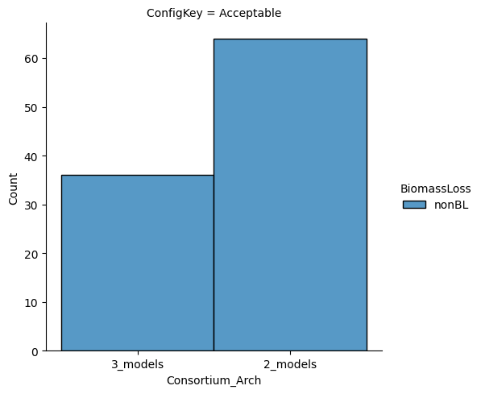{width=40%}


### 2.4.1 General Analysis: exchange rates {#SecondExample_GeneralAnalysis_exchangeRates}

Before starting the analysis, an important disclaimer should be stated: **uptake rates take negative values by convention**. However, a more-negative uptake rate (i.e. lower value) means a higher uptake, since the true meaning relies on the absolute value.

The different consortium architectures were compared in terms of exchange rates (sucrose, fructose and nitrogen uptake rates) by means of several barplots (Figure 2)[^footnote1]. Note that all configurations displayed were acceptable configurations without biomass loss. \newline

[^footnote1]: Scatterplots comparing fitness (mM / gL^-1^) *vs*. uptake rates were also available but were not included in this report, since they did not provide with useful information. See GeneralAnalysis/Plot_allConfigs folder.

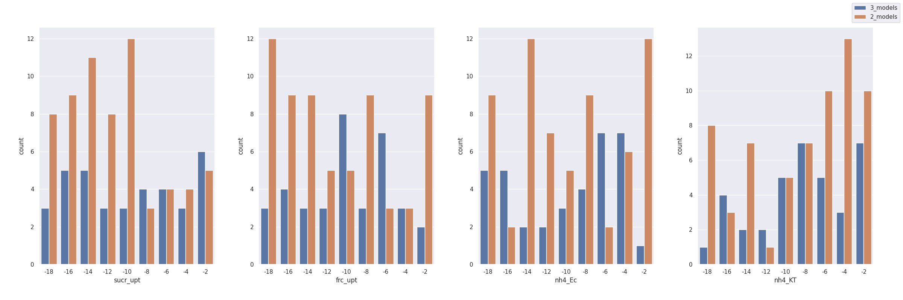{width=100%}

* **Sucrose** was the main substrate for the *E.coli iEC1364W* strains: the base strain in the 2-model consortium and both (base and decorator) strains in the 3-model case. However, the decorator strain could also consume fructose. The **far-left plot** showed how more-negative values for sucrose uptake (-18 to -10 mmol/ g DW h) were more frequent for the 2-model consortium; while the number of configurations was more equally distributed along the sucrose uptake interval for the 3-model consortium. \newline

* **Fructose** was the main substrate for the *P.putida iJN1463* strain. However, the *E.coli iEC1364W* decorator strain could also consume fructose. The **middle-left plot** showed how either more-negative (-18 to -14) or less-negative values (-8, -2 mmol/ g DW h) were more frequent for the 2-model consortium; while the number of configurations was more equally distributed along the fructose uptake interval for the 3-model consortium, with higher peaks in (-10, -6 mmol/ g DW h). \newline 

* The **middle-right plot** showed the distribution of nitrogen uptake rates for all *E.coli iEC1364W* strains in both consortia. For the 2-model consortium, $NH_4$ uptake rates were frequent for values like -14 or -2, and secondly for values like -18 and -8 (mmol/ g DW h). In general, the distribution of configurations was non-uniform along the interval. At the same time, the 3-model consortium tended to less-negative values of $NH_4$ uptake (-6, -4 mmol/ g DW h), and secondly more-negative values instead (-18, -16 mmol/ g DW h). \newline

* The **far-right plot** showed the distribution of nitrogen uptake rates for the *P.putida iJN1463* strain in both consortia. For the 2-model consortium, $NH_4$ uptake rates were more frequent for less-negative values (above -8 mmol/ g DW h), with some configurations with more-negative values as well (-18, -14 mmol/ g DW h). In general, the distribution of configurations was non-uniform along the interval. At the same time, the 3-model consortium tended to less-negative values like -8, -2 or secondly, -10 and -6 (mmol/ g DW h). \newline


### 2.4.2 General Analysis: FVA rates {#SecondExample_GeneralAnalysis_FVARates}

On the other hand, the analysis of the **FVA rates for intermediate and final products** was considered (Figure 3): p-coumarate by *E.coli iEC1364W* (base strain in both consortia), fructose by *E.coli iEC1364W* (base strain in both consortia), naringenin by *P.putida iJN1463* and 6-Geranyl-Naringenin by *E.coli iEC1364W* (base or decorator strain)[^footnote2] (Figure 3). Note that the higher the FVA rate (%) for a given compound, the lower the metabolic flux deviated towards its production. \newline

[^footnote2]: Again, scatterplots comparing fitness (mM / gL^-1^) *vs*. FVA rates were also available but were not included in this report, since they did not provide with useful information. See GeneralAnalysis/Plot_allConfigs folder.

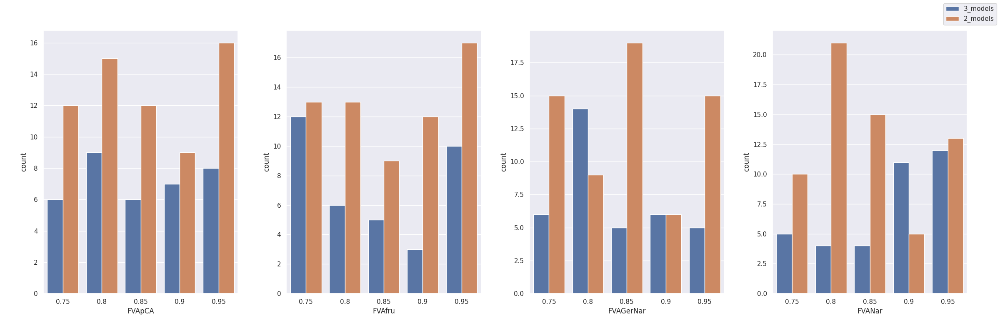{width=100%}

* The plot on the far-left showed the values of **p-Coumarate FVA**. For the 2-model consortium, the number of configurations tended to be higher for intermediate (0.80) or very high (0.95) FVA rates (i.e. medium-to-low flux deviated towards p-Coumarate production). For the 3-model consortium, the number of configurations was more equally distributed along the FVA rate interval. \newline

* The plot on the medium-left showed the values of **fructose FVA**. For the 2-model consortium, the number of configurations was more abundant for intermediate (0.75, 0.80) or very high (0.95) FVA rates. For the 3-model consortium, the number of configurations tended to be higher for an intermediate FVA rate (0.75) and secondly, for a very high (0.95) FVA rate. \newline

* The plot on the medium-right showed the values of **6-Geranyl-Naringenin FVA**. For the 2-model consortium, the most common values were 0.75, 0.85 and 0.95. However, for the 3-model consortium, lower values were far more common (0.8). \newline

* The plot on the far-right showed the values of **naringenin FVA**. For the 2-model consortium, the most common values were 0.8 and 0.85; while being higher (0.9 and 0.95) for the 3-model consortium. \newline


## 2.5. Pairwise Variable Analysis {#SecondExample_PairwiseVariableAnalysis}

In this second section, the different consortium architectures were evaluated in terms of pairwise interactions[^pairwise_interactions_disclaimer] between variables of interest. It is worth remembering that all configurations were acceptable, with no biomass loss for both 2-model and 3-model cases.

[^pairwise_interactions_disclaimer]: Recall that uptake rates take negative values by convention. Thus pairwise interactions (in heatmaps and pairgrid plots) between uptake rates and the rest of variables are inverted: i.e. a negative correlation between nitrogen uptake and final biomass would mean that, the higher the nitrogen uptake, the higher the final biomass. This eventuality does not hold true for pairwise interactions between uptake rates themselves, since both in every pair would be negative.

### 2.5.1. Fitness evaluation with respect to SD {#SecondExample_PairwiseVariableAnalysis_fitnessScatter}

The next figure (Figure 4) displays the variation of fitness SD with the fitness variable by means of a scatterplot. 

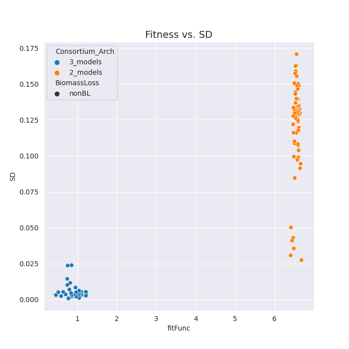{width=40%}

On the one hand, the **3-model consortium** achieved lower values of fitness (value range: from near 0 to 1.2-1.4 mM / g·L^-1^), which might have led to lower values of standard deviation (under 0.025 mM / gL^-1^). On the other hand, the **2-model consortium** achieved higher values of fitness (between 6 and 7 mM / gL^-1^) with a more widespread SD (between 0.025 and 0.175 mM / gL^-1^), but still not being too high. \newline


### 2.5.2. Pairgrid plotting {#SecondExample_PairwiseVariableAnalysis_pairgrid}

Figure 5 shows a pairgrid integrating uptake rates, global biomass register and 6-Geranyl-Naringenin production. This figure is composed of three sections.

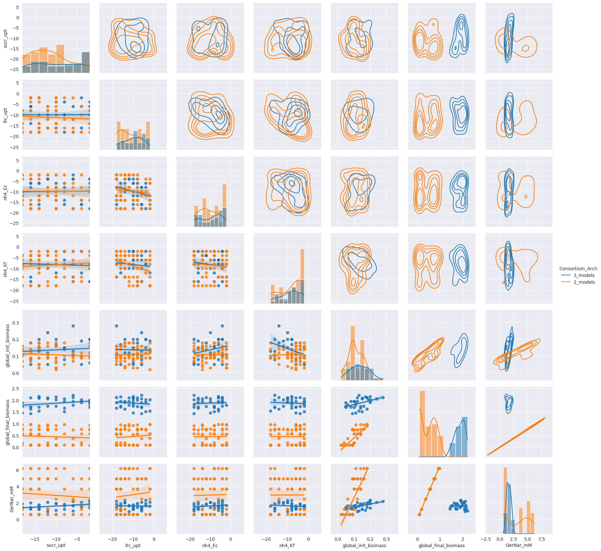{width=100%}

* The **lower corner** displayed a **scatterplot-regression plot**. This type of plot made evident the positive correlation between global final biomass and initial biomass for the 2-model group, being this relationship more moderated for the 3-model group. At the same time, there was also a similar correlation between final production of 6-Geranyl-Naringenin and both global initial and final biomass for the 2-model consortium, being very slight or non-existent for the 3-model consortium. There were no substantial differences between models in terms of uptake rates.

* The **pairgrid diagonal** displayed a **barplot** with a histogram line where the degree of similarity (overlapping) between consortium architectures was measured for each variable. The greatest differences were found for the final biomass and, to some extent, for the final production of 6-Geranyl-Naringenin.

* The **upper corner** displayed a **kdeplot** (Kernel Density Estimation plot) where both the correlation between two variables and the degree of overlapping between consortium architectures were evaluated. No substantial differences could be appreciated between the 3-model and 2-model groups in terms of uptake rate interaction. However, there was a medium-to-low degree of overlapping between consortium architectures for any variable (except final biomass, with no-overlapping) *vs*. final production of 6-Geranyl-Naringenin. Moreover, there was no-overlapping at all for any variable *vs*. final biomass production. \newline


### 2.5.3. Heatmap representation {#SecondExample_PairwiseVariableAnalysis_heatmap}

Figure 6 shows the heatmap for the 3-model consortium case. Acceptable configurations without biomass loss were considered for its construction.

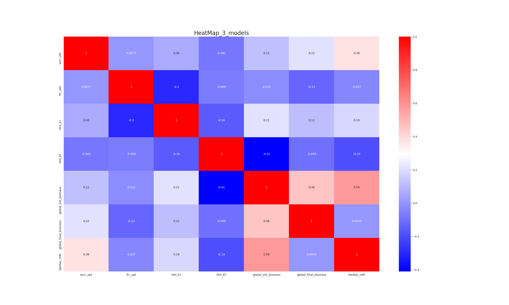{width=100%}

* There was a positive correlation for sucrose uptake with final 6-Geranyl-Naringenin production (0.38) and with final biomass (0.22), i.e. higher sucrose uptakes would lead to lower consortium production rates.

* There was a moderate, negative correlation between fructose uptake rate and nitrogen uptake rate for the *E.coli iEC1364W* model (-0.30), indicating that fructose secretion by the *E.coli iEC1364W* base strain might directly compete with its biomas developmemt.

    On the other hand, there were negative correlations between nitrogen uptake rate for the *P.putida iJN1463* model and initial biomass (-0.41) or final 6-Geranyl-Naringenin production (-0.19). In other words, *P.putida iJN1463* growth would result in higher 6-Geranyl-Naringenin production rates, probably because of naringenin synthesis.

* A slightly negative correlation between nitrogen uptake rates of *E.coli iEC1364W* and *P.putida iJN1463* (-0.16) was also found: the different microbial models were competing for the available $NH_4$.

* There was a positive correlation between the **initial** and the **final biomass** (0.46). There also was a positive correlation between the **initial biomass** and the **final 6-Geranyl-Naringenin production** (0.58).

* Surprisingly, the correlation between the **final biomass** and the **final 6-Geranyl-Naringenin production** was nearly non-existent (0.0034), thus they might be competing objetives in community evolution terms, or at least they do not contribute towards each other success. \newline


In turn, Figure 7 shows the heatmap for the 2-model consortium case. Acceptable configurations without biomass loss were considered for its construction.

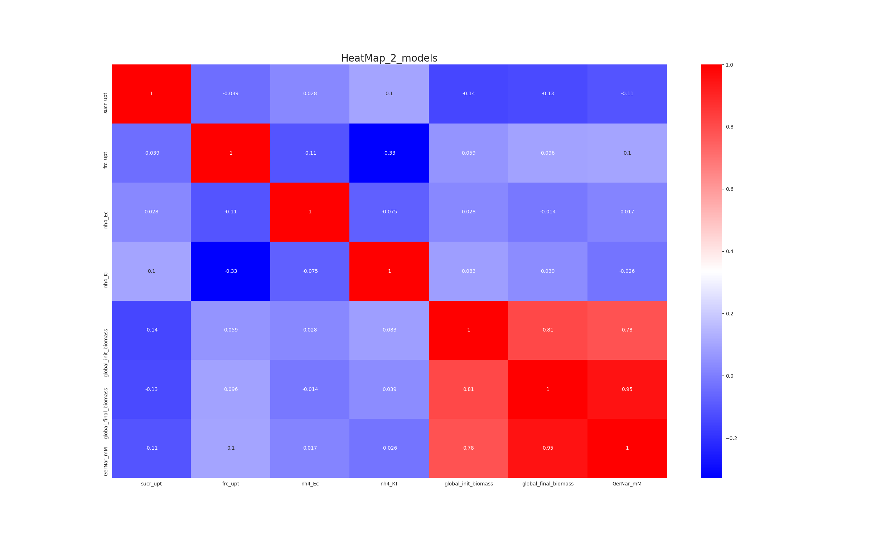{width=100%}

* There were moderate, negative correlations between sucrose uptake rate and initial (-0.14) and final biomass (-0.13), and 6-Geranyl-Naringenin production (-0.11). This eventuality indicated that sucrose uptake was favorable to biomass growth and fitness in the 2-model scenario.

* Fructose uptake rate showed negative correlations with nitrogen uptake rate for the *E.coli iEC1364W* (-0.11) and *P.putida iJN1463* (-0.33) models. In the *P.putida iJN1463* case, fructose could serve for both biomass growth or 6-Geranyl-Naringenin production. Since this consortium was shifted towards 6-Geranyl-Naringenin production, fructose negatively correlated with nitrogen uptake (i.e. biomass growth).

* Highly positive correlations were found for **initial biomass** with **final biomass** (0.81) and with **final 6-Geranyl-Naringenin production** (0.78). Similarly, a very pronounced correlation appeared between **final biomass** and **6-Geranyl-Naringenin production** (0.95). \newline


## 2.6. Biomass & Production Analysis {#SecondExample_BiomassProductionAnalysis}

In this third section, the different consortium architectures were evaluated in terms of a) individual biomass states at the beginning and end of every simulation; b) final production of naringenin and 6-Geranyl-Naringenin; and c) consumption of substrates. Recall that all configurations were acceptable, with no biomass loss for both 2-model and 3-model cases. Only acceptable configurations with non-biomass loss were considered.

### 2.6.1. Biomass Analysis {#SecondExample_BiomassProductionAnalysis_biomassAnalysis}

On the one hand, global biomass was analyzed at the beginning and end of every simulation (Figure 8).

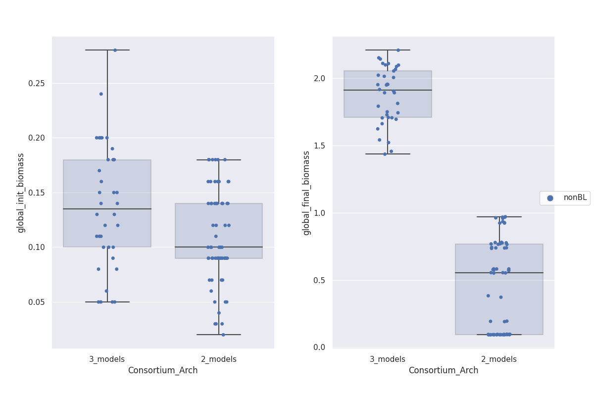{width=100%}

* The **global initial biomass** was higher on average for the 3-model consortium (0.14 gL^-1^) than for the 2-model case (0.10 gL^-1^). In the first case, the biomass interval ranged from 0.05 to near 0.30 (gL^-1^), while ranging from near 0 to near 0.20 (gL^-1^) in the second one.

* The **global final biomass** was much higher for the 3-model than for the 2-model consortium. In the first case, the biomass interval ranged from 1.50 to near 2.50 (gL^-1^), with an average value around 1.90 gL^-1^. In the second case, the biomass interval was contained from 0.0 to near 1.0 (gL^-1^), with an average value slightly above 0.6 gL^-1^. \newline


On the other hand, an individual analysis of biomass per strain for each of the consortium architectures was also developed (Figure 9).

* For the **3-model consortium**, initial values were similar for all three strains. However, while average final values for *P.putida iJN1463* and *E.coli iEC1364W* (base strain, iEC1364W) were similar (around 0.25 gL^-1^), the average final value for *E.coli iEC1364W* (decorator strain, iEC1364Wger) was much higher (near 0.75 gL^-1^). For all three strains, final biomass values ranged from 0.10 to 1.50 gL^-1^ or slightly above.

* For the **2-model consortium**, initial values were similar for both strains. Likewise, average final values for both *E.coli iEC1364W* (base strain, iEC1364Wuger) and *P.putida iJN1463* were also similar (around 0.2 gL^-1^), with biomass ranges from 0.05 to 0.6 gL^-1^.

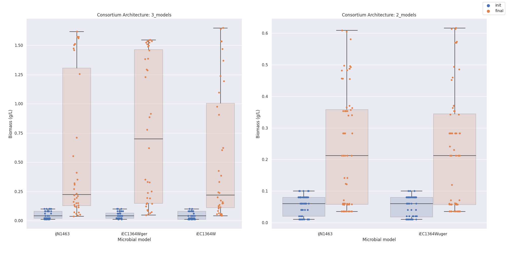{width=80%}


### 2.6.2. Production Analysis {#SecondExample_BiomassProductionAnalysis_productionAnalysis}

Firstly, Figure 10 displayed the final concentration for several metabolites (substrates, products) with distinction by consortium architecture.

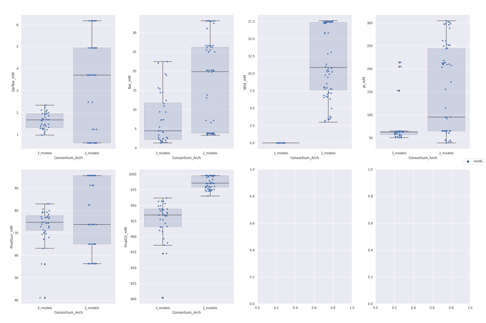{width=80%}

* **Final production values of 6-Geranyl-Naringenin** were more widespread for the 2-model architecture. Moreover, average production was around 1.6-1.8 mM for the 3-model case, and around 3.5-3.8 mM for the 2-model case.

* **Naringenin production ranges** were widespread for both consortium architectures. However, average values were quite different: around 5.0 mM for the 3-model case and 20.0 mM for the 2-model case.

* **Nitrogen ($NH_4$)** was always fully exhausted for the 3-model case configurations, while displaying a quite dispersed range of values (from near 18.0 to 2.5 mM) for the 2-model configurations. The average value for this last architecture was around 10.0-11.0 mM.

* **Phosphate ($P_i$)** was usually consumed to a low extent (at the most, 20 mM reduction from the original 69.9 mM) for the 3-model case, though there were a few cases where $P_i$ was produced. A wider variability was found for the 2-model case: some configurations where phosphate was consumed to a certain extent (20-40 mM reduction); a few configurations where it was not substantially consumed; and a bunch of cases where it was produced to an intermediate-to-high extent (30 to 250 mM).

* **Final sucrose concentration** was around 65 to 85 mM for most of the configurations of the 3-model architecture. For the 2-model case, a wider final sucrose range was found (from 55 to near 100 mM). However, average values were similar (75 mM) for both consortium architectures.

* **$O_2$ consumption** was higher for the 3-model configurations, with a final average concentration around 930-940 mM, within an interval from 880 to 960 mM. For the 2-model configurations, final average $O_2$ concentrations were higher (~980 mM, which implied a lower oxygen consumption) within a narrower interval (960 to 1000 mM). \newline


Secondly, it was worth considering **the cycle when the main substrates were finally exhausted**, if appropriate (Figure 11). In general, neither sucrose, nor oxygen or $P_i$ were fully consumed in any of the configurations for any of the consortium architectures. However, while **$NH_4$** was never exhausted during the simulation for the 2-model case; it was usually fully consumed for the 3-model case, between cycles 50 and 200 (on average, around cycle 140 out of 240).

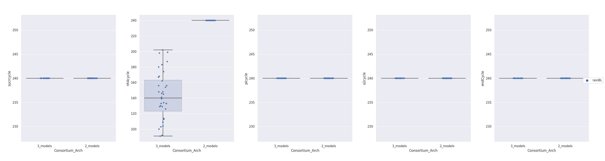{width=100%}

Figure 11 might not be fully useful, given that four out of five plots are just a line of points in the same y-value for both consortium architectures. Thus there was an alternative instead: using an statistical descriptive document where the average endcycle of nutrient exhaustion (among other statistical variables) was indicated. \newline

For the **3-model configurations**:

  * Sucrose cycle of final exhaustion: 240.0 $\pm$ 0.0
  * $O_2$ cycle of final exhaustion: 240.0 $\pm$ 0.0
  * $P_i$ cycle of final exhaustion: 240.0 $\pm$ 0.0
  * $NH_4$ cycle of final exhaustion: 142.75 $\pm$ 30.7
  * General endcycle: 240.0 $\pm$ 0.0 \newline
  
For the **2-model configurations**:

  * Sucrose cycle of final exhaustion: 240.0 $\pm$ 0.0
  * $O_2$ cycle of final exhaustion: 240.0 $\pm$ 0.0
  * $P_i$ cycle of final exhaustion: 240.0 $\pm$ 0.0
  * $NH_4$ cycle of final exhaustion: 240.0 $\pm$ 0.0
  * General endcycle: 240.0 $\pm$ 0.0 \newline
  
Therefore, **nitrogen was exhausted in all 3-model architecture cases** (the maximum value for nitrogen exhaustion cycle was 202.0) but in none of the 2-model configurations. The rest of substrates were never fully consumed in any of the consortium architectures. \newline
  

In turn, **the cycle were naringenin and 6-Geranyl-Naringenin production started or was stabilized** has been registered. Production stabilization was considered to happen when the concentration of a given metabolite was above 1.0 mM (Figure 12).

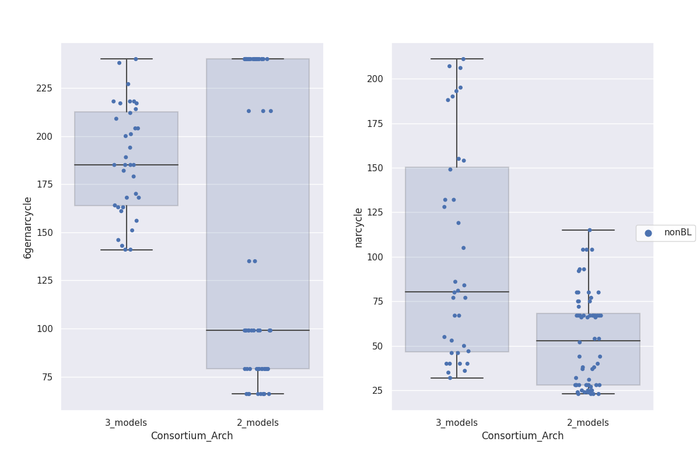{width=80%}

* On average, **6-Geranyl-Naringenin production** started before for the 2-model configurations (cycle 100) than for the 3-model cases (around cycle 180). In general, the stabilization of 6-Geranyl-Naringenin production happened between cycles 50 and 240 for the 2-model configurations, and between 140 and 240 cycles for the 3-model cases.

* To a similar extent, **naringenin production** started before for the 2-model configurations (around cycle 50) than for the 3-model cases (around cycle 80), on average. However, in this case the production range was narrower for the 2-model configurations (between cycles 25 to 120) than for the 3-model cases (between cycles 30 to 220). This might have pointed out that naringenin production was more stable in the 2-model scenario. \newline


A similar statistical analysis was performed for the last two variables, as a more compact summary of production stabilization.

For the **3-model configurations**:

  * Naringenin cycle for production stabilization: 101.2 $\pm$ 60.3
  * 6-Geranyl-Naringenin cycle for production stabilization: 187.7 $\pm$ 28.3 \newline
  
For the **2-model configurations**:

  * Naringenin cycle for production stabilization: 53.2 $\pm$ 26.1
  * 6-Geranyl-Naringenin cycle for production stabilization: 151.5 $\pm$ 77.4 \newline

Therefore, **naringenin production was usually started before for the 2-model configurations** (around cycle 50) than for the 3-model cases (around cycle 100). In turn, the moment of beginning for 6-Geranyl-Naringenin production was around cycle 150 for 2-model architectures and around cycle 190 for 3-model cases. Note that all these cycle values had an important standard deviation. \newline


Finally, a scatterplot to assess the **relationship between 6-Geranyl-Naringenin and naringenin production** was elaborated (Figure 13). In the 2-model community, there was a directly proportional relationship between both products. However, in the 3-model case this relationship turned out to be 
inversely proportional to a certain extent.

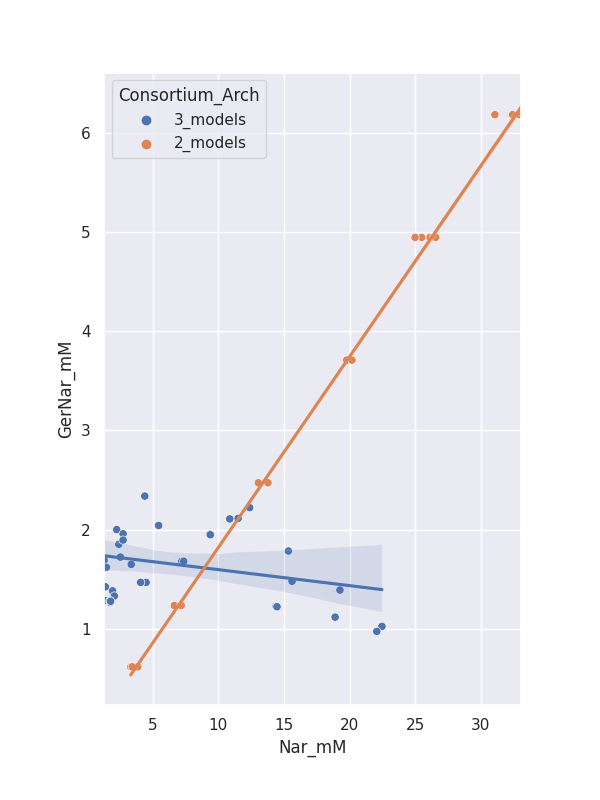{width=40%}


\newpage
## 2.7. Global Conclusions {#SecondExample_globalConclusion}

The following conclusions were drawn according to the main concerns of the current analysis.

### 2.7.1. Determine which of both consortium architectures was better suited for 6-Geranyl-Naringenin production

  * In general, **a higher fitness was obtained for 2-model configurations** (6.55 $\pm$ 0.060 mM / gL^-1^) than for 3-model cases (0.88 $\pm$ 0.21 mM / gL^-1^). For this reason, there might have been more cases for the 2-model (64) than for the 3-model (36) scenario.
  
  * **Final biomass** was usually lower for 2-model configurations (0.45 $\pm$ 0.34 gL^-1^ *vs*. 3-model cases: 1.87 $\pm$ 0.21 gL^-1^), even with somewhat comparable initial biomass levels.
  
  * While **average naringenin production** was notably higher (15.95 $\pm$ 11.36 mM *vs*. 3-model cases: 7.54 $\pm$ 6.49 mM), **average 6-Geranyl-Naringenin production** was just slightly higher for the 2-model architecture (2.96 $\pm$ 2.19 mM *vs*. 3-model cases: 1.63 $\pm$ 0.37 mM). Moreover, naringenin and 6-Geranyl-Naringenin production were begun and stabilized before (on average) for the 2-model configurations.
	
  * **Initial and final biomasses were clearly correlated in a positive manner** with 6-Geranyl-Naringenin production in the 2-model scenario. On the other hand, for the 3-model configurations, there was a positive correlation between initial biomass and 6-Geranyl-Naringenin production; but no relationship between final biomass and final production.
  
  * While **average sucrose consumption was comparable** for both scenarios, **$NH_4$ consumption** was clearly more pronounced in the 3-model consortium, a fact which might have been related to the higher final biomass for this architecture.  
	
  * In this sense, **final oxygen levels** were lower in the 3-model consortium (927.38 $\pm$ 29.3 mM *vs*. 2-model case: 987.56 $\pm$ 9.91 mM). At the same time, **final $P_i$ levels** were also very different: 70.67 $\pm$ 37.86 mM for the 3-model case *vs*. 149.08 $\pm$ 94.41 mM for the 2-model case. In other words, while $P_i$ reached a balance between consumption and production in the 3-model case, it was produced to a high extent in the 2-model case. 
	
	  Therefore, in the 3-model consortium case, biomass growth might have led to higher aerobic respiration rates, with a notable $O_2$ consumption and a balance of generation/production of ATP (thus maintaining a constant $P_i$ concentration). However, in the 2-model consortium, aerobic respiration rates would have been lower with a high ATP consumption, thus allowing for naringenin and 6-Geranyl-Naringenin production and increasing final phosphate levels. \newline
	
The last facts indicated that **the 2-model consortium was more oriented to naringenin and 6-Geranyl-Naringenin production**, while the 3-model consortium was essentially shifted towards biomass evolution. \newline


### 2.7.2. Find a range of optimal nutrient uptake rates and initial biomasses

  * There were **no real differences in term of fitness** (mM / gL^-1^) with respect to any uptake rates, for any of the consortium architectures (scatterplots, not shown in the current report).
  
  * More-negative values (i.e. higher uptake rates) of **sucrose and fructose uptake** were more common for the 2-model consortium (-18 to -10 mmol/ g DW h). This fact could be influential for the **higher fitness and naringenin / 6-Geranyl-Naringenin production rates** in this consortium context. In this sense, there was a positive correlation between sucrose uptake and 6-Geranyl-Naringenin for the 3-model case, i.e. a negative influence of higher sucrose flux in consortium production.
  
  * **Nitrogen uptake** for the *E.coli iEC1364W* models seemed variable for the 2-model cases, but it displayed a certain tendency towards less-negative values (above -10 mmol/ g DW h, i.e. lower uptakes) for the 3-model configurations. With regard to *P.putida iJN1463* model, in both consortium architectures were more common those less-negative values (above -10 mmol/ g DW h, i.e. lower uptakes).
  
  * **Exchange rate interferences for 3-model consortium** (see heatmap):
	  
	  - A moderate negative correlation between $NH_4$ (*E.coli iEC1364W*) and fructose (*P.putida iJN1463*) rates, i.e. higher nitrogen uptake by *E.coli* base strain might lead to lower secretion of fructose, thus shifting fructose uptake by *P.putida* towards lower values.
	  
	  - A negative correlation of $NH_4$ (*P.putida iJN1463*) uptake rate with initial biomass, and also a moderate, negative correlation with 6-Geranyl-Naringenin production, i.e. a wider biomass development of *P.putida iJN1463* would lead to higher naringenin production.
	  
    - In general, the fact that there were two *E.coli iEC1364W* strains might have hindered 6-Geranyl-Naringenin production to some extent: since the base strain was responsible for p-Coumarate and fructose secretion, with a different strain for naringenin decoration, fructose secretion could have been higher. This eventuality would have led to a wider *P.putida iJN1463* biomass development because of substrate availability, at the expense of certain naringenin production.
	  
  * **Uptake rate interferences for 2-model consortium** (see heatmap):
	  
    - A negative correlation between $NH_4$ and fructose uptake rates by *P. putida iJN1463*, i.e. a higher fructose uptake and thus substrate availability within the *P.putida* cell might have led to higher naringenin production, reducing biomass development by means of a lower nitrogen uptake.
    
    - A moderate negative correlation between sucrose uptake rate and initial and final biomass, and 6-Geranyl-Naringenin production. This circumstance would imply that higher sucrose availability entailed higher consortium production. \newline
    
In general, it was **uneasy to circumscribe exchange rates to optimize the consortium**. However, certain changes might contribute towards this objective[^footnote3].
  
  * **More-negative substrate uptake rates** (sucrose, fructose) around -18 to -10 mmol/ g DW h (i.e. higher flux values) would boost consortia production. However, it is important to maintain a reasonable sucrose availability or instead, moderate flux levels, to avoid the inhibition of product formation (specially in the case of the *E.coli iEC1364W* models).

  * **Biomass development and product formation directly competed** in each model fitness function, thus a balance was needed between both aims. In this sense, **moderate nitrogen uptake rates** (above -10 mmol/ g DW h) might avoid a disproportionate biomass development (i.e. lower flux values).
  
   * Finally, the existence of different strains of *E.coli iEC1364W* with the same substrate and sucrose and nitrogen uptake rates might have **limited the consortium convergence** towards 6-Geranyl-Naringenin production in the **3-model scenario**. 
  
      However, having *E.coli iEC1364W* strain as responsible for **too many metabolic tasks** (i.e. fructose and p-Coumarate secretion, naringenin decoration) **in a 2-model scenario** might also hinder consortium production in experimental environments. \newline
  
[^footnote3]: These changes need further computational and experimental verification and might not lead to the indicated results. They should be taken as recommendations instead of as definite conclusions.
  
With respect to **initial biomass values**, they were reasonable as presented in the current FLYCOP configuration. The only key note to be considered was that the *E.coli iEC1364W* model (decorator strain) experienced a notably higher growth (on average) than the other two strains (*E.coli iEC1364W* model decorator strain; *P. putida iJN1463*) in the 3-model consortium. \newline

	  
### 2.7.3 Obtain a reasonable combination of FVA rates
	
There were no clear conclusions with the current analysis of FVA rates through barplots. Despite the last fact:
	
  * Regarding **fructose FVA rates**, 0.75 (i.e. higher flux towards fructose secretion) was the most common value for 3-model cases, while 0.95 was the most frequent one for 2-model configurations.
	
  * Regarding **naringenin FVA rates**, while the 2-model consortium tended to low-to-medium values (higher flux towards naringenin secretion), the 3-model community was shifted towards higher FVA rates.
	
  * Regarding **6-Geranyl-Naringenin FVA rates**, the 2-model consortium values were quite variable. However, 3-model configurations had a 0.8 rate as the most common value. \newline
  
In the **3-model case**, fructose most common FVA rate was quite low (high flux) for quite high naringenin FVA rates (low to very low flux deviated towards naringenin production). This fact could explain why biomass development was higher than for the 2-model consortium, since naringenin synthesis was not as favoured.

The **2-model case** displayed intermediate values of p-Coumarate and fructose FVA rates, with usually lower values for naringenin FVA. For this reason, 6-Geranyl-Naringenin might have been boosted by naringenin availability, at the potential expense of biomass development.

However, it is important to note that **these interpretations were subject to the limitations of the current FVA analysis**. A different approach might be developed soon, where different FVA rates could be properly assessed in terms of their pairwise interactions. 

Moreover, it is important to note that **6-Geranyl-Naringenin FVA rates corresponded to different microbe models** depending on the consortium architecture: to the unique *E.coli iEC1364W* strain in the 2-model consortium, or to the decorator strain (also *E.coli iEC1364W*) in the 3-model consortium. **Differences between consortia in terms of individual metabolic capabilities** were probably influencing the general community fitness and should be further studied in detail. \newline
  
  
### 2.7.4. Final comment

Further optimization of the current consortia, in terms of uptake and FVA rates, would be beneficial to confirm the indications here displayed. In this sense, a 2-model consortium seemed to be better suited for the metabolic objective (6-Geranyl-Naringenin production) purposed, but it might also be more prone to metabolic incompatibilities (i.e. if the same model is responsible for several metabolic tasks). For this reason, exploring larger consortium architectures could be interesting as well.


